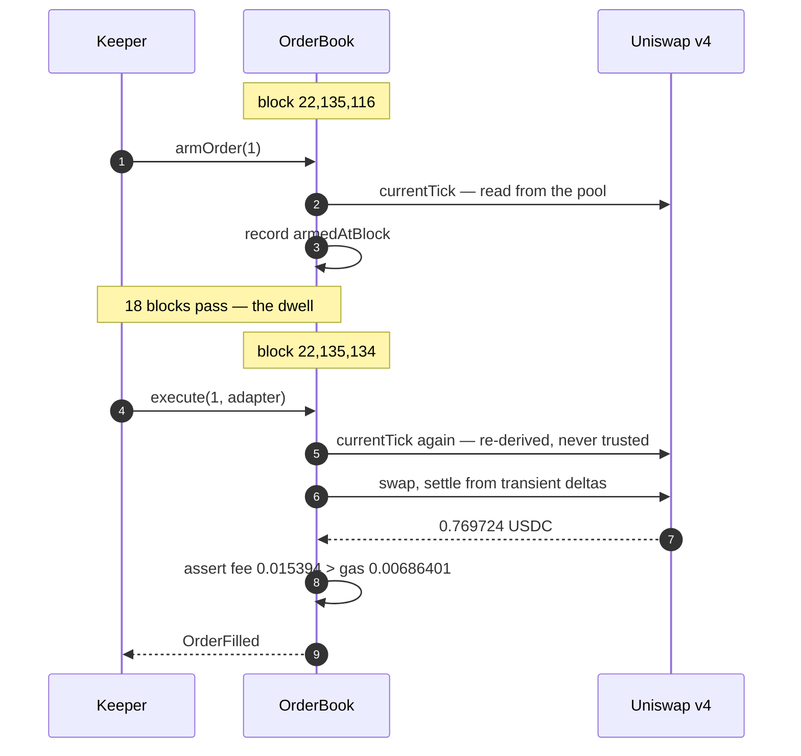
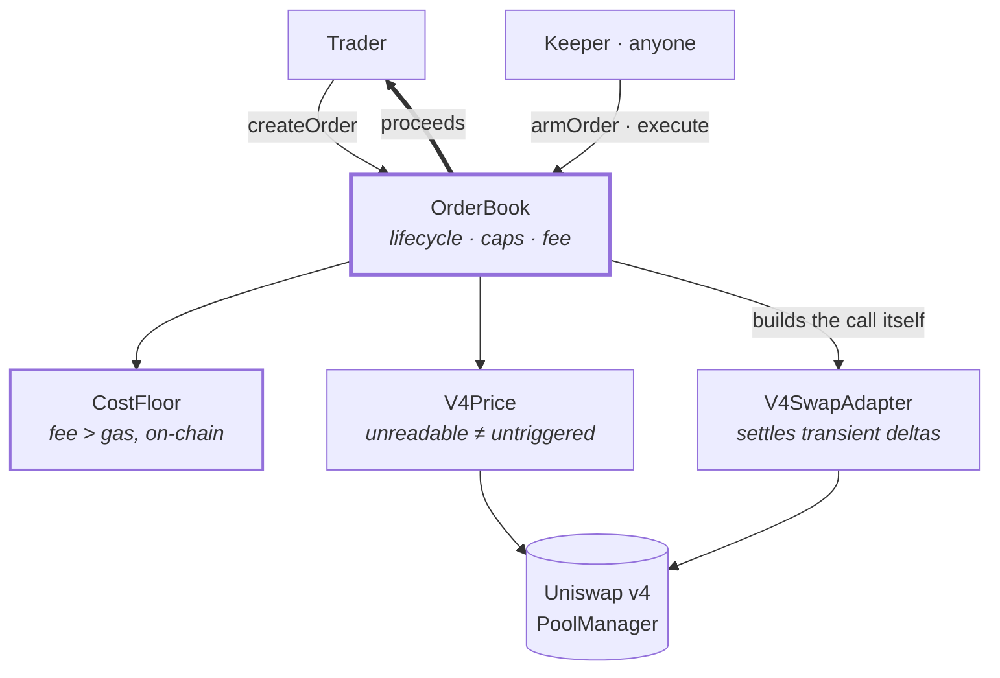
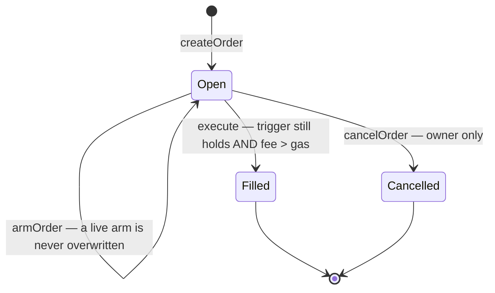

# Arc Conditional Orders

**Stop-losses that prove they were worth executing.**

An order names a pool, a tick threshold and a direction. A keeper observes the trigger in one
block, waits out a dwell period, and fills in a later one — then the contract proves *on-chain*
that the fee it collected exceeded the gas that fill burned.

> **Live on Arc mainnet** — three real fills, one of which the cost floor refused until gas
> fell. 71 tests against a mainnet fork. An adversarial
> review before deployment found two fund-loss bugs; both fixed, both with regression tests.
> Exposure capped on-chain at 10 USDC per fill.

| | |
| --- | --- |
| **OrderBook** | [`0x9872b13257E958c2F7E4DcCc3F96b3C70c8e050c`](https://explorer.arc.io/address/0x9872b13257E958c2F7E4DcCc3F96b3C70c8e050c) |
| **Swap adapter** | [`0x0F1bf92EE0C79F7Ca5C1e30E9412aD5BFF45c7C8`](https://explorer.arc.io/address/0x0F1bf92EE0C79F7Ca5C1e30E9412aD5BFF45c7C8) |
| **App** | [arc-conditional-orders.vercel.app](https://arc-conditional-orders.vercel.app) |

---

## Filling on mainnet

Nobody pressed anything. An order was created; the hosted keeper did the rest.



| | |
| --- | --- |
| Fill | [`0x580a4b38…`](https://explorer.arc.io/tx/0x580a4b38890ba9241f7bbaf5fd389b3a534e7c155d98381e06677f214a7e3302) |
| Arm | [`0x07e15e8a…`](https://explorer.arc.io/tx/0x07e15e8a5ea2a635941f5d51c315919196be16f8f0051275046c2a99c64e7480) |
| Proceeds → gas | 0.769724 → 0.00686401 USDC · **2.24× margin** |

**Eighteen blocks between arm and fill.** That gap *is* the security property: a price spike
reverted inside one transaction cannot satisfy two observations in two different blocks.

### Three fills, and one that had to wait

| Order | Proceeds | Fee | Gas | Margin | |
| --- | ---: | ---: | ---: | ---: | --- |
| 1 | 0.769724 | 0.015394 | 0.00686401 | 2.24× | [tx](https://explorer.arc.io/tx/0x580a4b38890ba9241f7bbaf5fd389b3a534e7c155d98381e06677f214a7e3302) |
| 3 | 1.990132 | 0.009950 | 0.00804768 | 1.24× | [tx](https://explorer.arc.io/tx/0xf2487b593d885a2fa1a8d50ccbd2cd026ea8e3c8d2617f6881a490fd247155f3) |
| 2 | 1.716212 | 0.008581 | 0.00663479 | 1.29× | [tx](https://explorer.arc.io/tx/0x63691eb4c7d282a5f0241c0ff194f1696349a7a10d0ae613a87d7177e5ff7c94) |

**Order 2 is the one worth reading twice.** Measured at 24.85 Gwei, its fee of 0.008464 USDC sat
*under* a gas cost of 0.00889245 — so `CostFloor` refused it and the keeper skipped it, while
order 3 filled normally. Eighteen blocks later gas had fallen, the same order cost 0.00663479 to
execute, and it cleared at 1.29×.

Nothing about the order changed. Only the real cost of running it did. That is the difference
between an invariant and a hard-coded minimum — and it is visible on-chain rather than asserted
here.

---

## Why this is an Arc protocol, not a port

On-chain stop-losses are a dead idea almost everywhere. Executing one costs more gas than a
small position is worth, and the executor's profitability can only ever be *estimated* — gas is
denominated in the chain's native asset, proceeds in the traded one. Comparing them needs a
price oracle and carries basis risk.

On Arc, **gas is USDC and proceeds are USDC.** The comparison collapses into arithmetic on two
numbers the EVM already exposes, so profitability stops being a heuristic and becomes an
invariant the contract enforces:

```
cost = (gasConsumed + 21000 + calldataBytes·16 + settlementOverhead) × tx.gasprice

revert unless   fee ≥ cost + margin
```

Intrinsic gas and calldata come from the EVM's own rules rather than a hand-tuned constant, so
the floor is checkable by *reading the contract* instead of trusting whoever runs the keeper.

That claim is not portable. It is only honest on a chain where gas and value share a unit.

---

## How it fits together



The keeper decides **when** to attempt a fill. The contract decides **whether** the attempt is
valid — and builds the router call itself from the order, so a keeper cannot choose the pool,
the amount or the recipient.

### The order's life



Funds stay in the trader's wallet until the moment of the fill. No deposit, no vault, no
custodian.

---

## Security

An adversarial review ran over every contract from a different attacker's angle — arithmetic,
access control, economics, execution order, invariants, and the seams between them.

It found twelve issues. **Two could have cost user funds, and neither was visible from the test
suite, which passed throughout.** All are fixed, each with a regression test that fails against
the previous code:

| Issue | Fix |
| --- | --- |
| `execute` forwarded caller-authored calldata — the pool whose tick authorised a fill need not be the pool that filled it | The router call is built in-contract from `o.key`, `o.amountIn`, `address(this)` |
| `armOrder` reset the dwell clock on every call, letting anyone keep an order unfillable forever | A live, non-stale arm is never overwritten |
| `createOrder` accepted `minAmountOut == 0`, and the frontend always passed it | Rejected on-chain; the UI derives its floor from measured impact |
| Output balance snapshotted *before* the input was pulled in | Snapshot moved, and `tokenIn == TOKEN_OUT` rejected |
| Slippage checked on gross while the trader is paid net | Fee computed first; the bound binds on what the trader receives |
| `feeBps` unbounded and retroactive to signed orders | `MAX_FEE_BPS`, enforced in setter *and* constructor |

Full threat model and invariant map: **[x-ray/x-ray.md](x-ray/x-ray.md)** ·
**[x-ray/invariants.md](x-ray/invariants.md)** — 24 guards, 19 inferred invariants, 6 not
enforced on-chain.

### Known limitations

- **The keeper is operator-run, not permissionless.** The fee accrues to `feeRecipient` while
  gas is paid by `msg.sender`, so an independent keeper loses money on every fill.
- **`totalFilledUsdc` never decreases**, so the cumulative cap bounds lifetime throughput, not
  concurrent exposure.
- **`checkOrders` can return `Ready` for an order that will revert** — the view omits the caps
  and the cost floor that `execute` enforces.
- **`owner` has no transfer path**, and `armedTick` is recorded but never read: the dwell proves
  the trigger was true at two instants, not that it held between them.
- No formal verification, no stateful fuzzing, no audit by a firm. Hence the caps.

---

## Four Arc behaviours that shaped this code

Every constant is recorded in [data/ground-truth.json](data/ground-truth.json) alongside the
on-chain read that confirmed it. The chain overrides the documentation wherever they disagree.

1. **A USDC ERC-20 transfer moves native value.** Any contract receiving USDC needs a payable
   `receive()` or the transfer reverts.
2. **The ERC-20 view reads the native balance.** A test contract we never funded reported
   79,228,162,514,264,337. Measure deltas, never absolute balances.
3. **Native is 18dp, ERC-20 is 6dp, one balance.** Mixing them is wrong by 10¹² — and in one
   direction it silently passes everything. This one bit: an early depth measurement reported
   "0 bps impact" because a swap labelled `$50` moved 0.000001 USDC.
4. **The public RPC returns HTTP 429, and caps results at 2,000 per query.** Code that swallows
   either and returns an empty result reports "nothing found" with total confidence. Every
   client here retries with backoff and fails loudly.

---

## Running it

**Stock Foundry cannot run this suite.** Arc's USDC at `0x3600…` delegates to a precompile at
`0x1800…`; stock Foundry returns `OpcodeNotFound` and every test that moves USDC fails. Worse,
read-only tests still pass — so a suite that only reads goes green and proves nothing.

```bash
curl -sL https://github.com/circlefin/arc-foundry/releases/download/v0.8.0-2/arc-foundry-v0.8.0-2-x86_64-unknown-linux-gnu.tar.gz \
  | tar xz -C ~/.arc-foundry/bin
export PATH=$HOME/.arc-foundry/bin:$PATH

forge test                       # 71 tests against an Arc mainnet fork
npx tsx tools/preflight.ts       # refuses to let a broken deployment happen
npx tsx src/host.ts              # keepers + demo market maker, one health endpoint
```

`network = "arc"` is pinned in [foundry.toml](foundry.toml) so the flag cannot be forgotten.

| Path | What |
| --- | --- |
| [contracts/CostFloor.sol](contracts/CostFloor.sol) | The invariant. Stateless, reusable |
| [contracts/OrderBook.sol](contracts/OrderBook.sol) | Lifecycle, arm/dwell, caps, fee |
| [contracts/adapters/V4SwapAdapter.sol](contracts/adapters/V4SwapAdapter.sol) | Swaps, settled against transient deltas |
| [tools/preflight.ts](tools/preflight.ts) | Exits non-zero rather than returning a default |
| [SHIP.md](SHIP.md) | Deployment runbook — what is done, what remains |

## License

MIT
